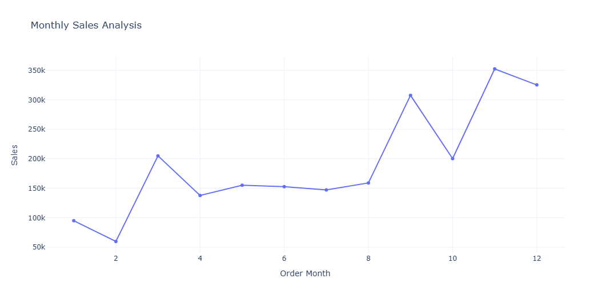
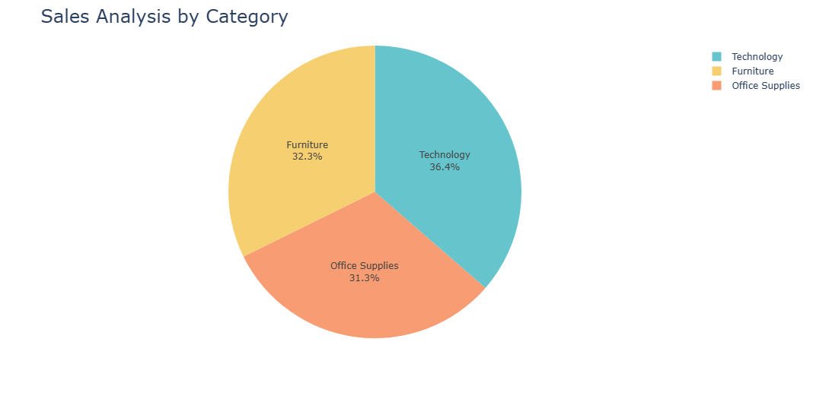
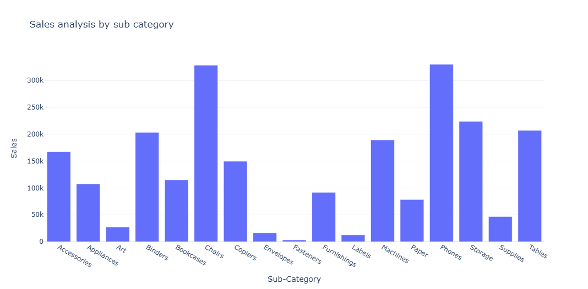
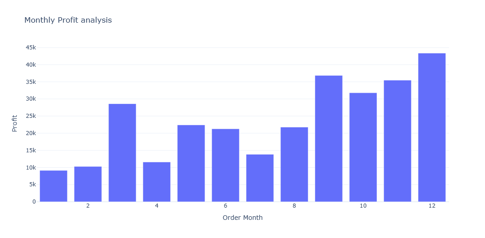
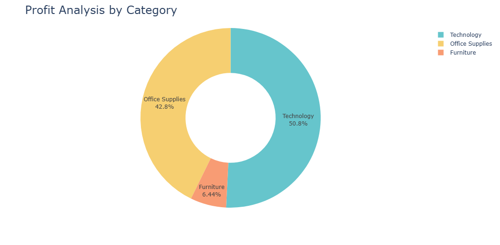
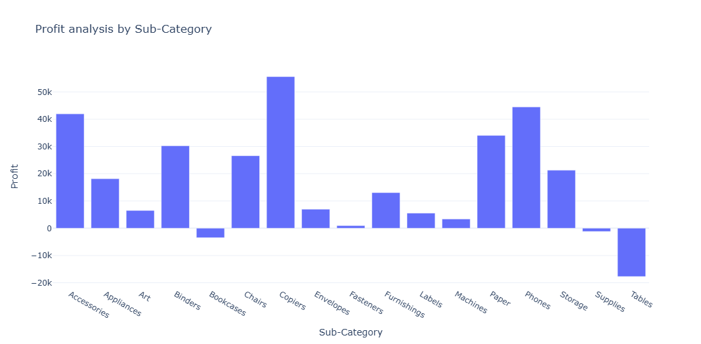
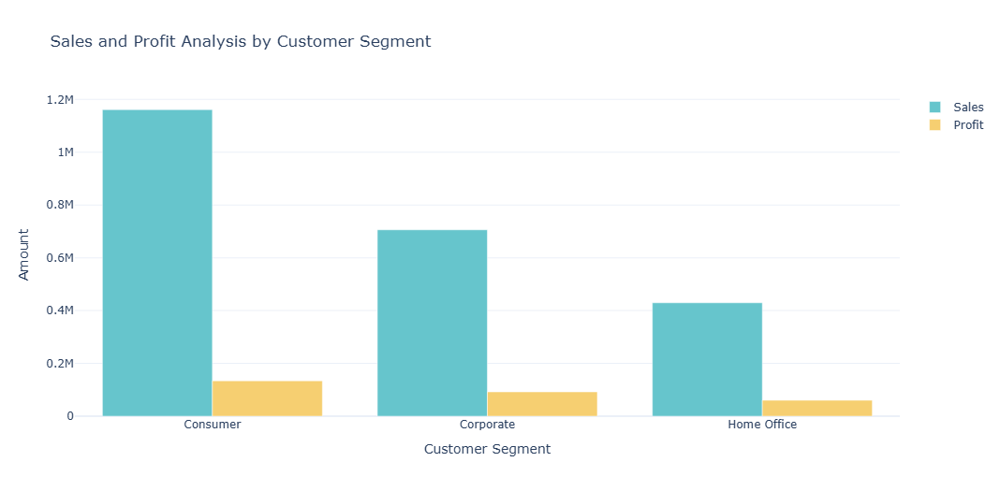

# 📊 Sales & Profit Analysis with Pandas & Plotly

This project provides a comprehensive analysis of sales and profit data using **Python (Pandas + Plotly)** inside a Jupyter Notebook.  
The notebook explores sales trends, profit distribution, and customer behavior with **interactive charts**.

---

## 🚀 Features

### 1. **Monthly Sales Analysis**
- Line chart showing sales trends across months.
- Helps identify seasonal sales patterns.

### 2. **Sales Analysis by Category**
- Bar chart comparing sales across product categories.

### 3. **Sales Analysis by Sub-Category**
- Breakdown of category-level sales into sub-categories.
- Identifies top-performing sub-categories.

### 4. **Monthly Profit Analysis**
- Line chart of monthly profits.
- Highlights profitable and loss-making months.

### 5. **Profit Analysis by Category**
- Category-level profit distribution.
- Helps understand which categories drive revenue vs. profit.

### 6. **Profit Analysis by Sub-Category**
- Detailed profit contribution by sub-category.

### 7. **Sales & Profit Analysis by Customer Segment**
- Comparison of sales and profits across customer segments (e.g., Consumer, Corporate, Home Office).
- Identifies the most profitable customer group.

### 8. **Sales-to-Profit Ratio**
- Ratio analysis to measure efficiency of sales turning into profit.
- Useful for identifying low-margin vs. high-margin areas.

---

## 🛠️ Tech Stack
- **Python**
- **Pandas** → data cleaning & aggregation  
- **Plotly Express / Graph Objects** → interactive visualizations  
- **Jupyter Notebook** → analysis & presentation  
